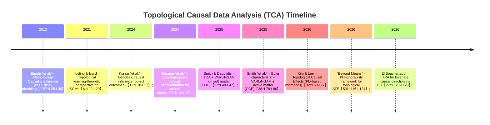

# Executive Summary

Causal inference and topological data analysis (TDA) are rich fields with minimal prior overlap, but recent work suggests a new domain of **Topological Causal Data Analysis (TCA)**. In this report we summarize key frameworks in causal inference (potential-outcome models, structural causal models with do-calculus, and causal discovery) and in TDA (persistent homology, Mapper, Reeb/nerve graphs, Euler-characteristic curves, etc.), and then survey emerging connections.  We compile foundational and recent (last ~10 years) papers in both areas, highlighting those at their interface. We identify several threads of “topological causal inference”: (a) *topological targets for causal effects*, where treatment effects are measured via changes in persistence diagrams or other shape summaries【32†L69-L77】【53†L116-L124】, (b) *topology-aware causal estimation*, employing topological features (persistence images, landscapes) in algorithms【53†L116-L124】【29†L13-L22】, and (c) *topological causal discovery*, using TDA to assist structure learning (e.g. combining persistence features with VARLiNGAM)【37†L40-L47】【38†L78-L86】.  We note that topological summaries are *stable* under perturbation (Cohen-Steiner et al. 2007) and can capture complex data modalities (graphs, shapes).  Key open problems include identifiability conditions for topological causal effects (e.g. persistent-homology ignorability)【53†L116-L124】, efficient computation for high-dimensional or large-scale data, and methods to combine topological metrics with graphical assumptions.  We propose methodological directions (e.g. doubly-robust estimators for functional/diagram-valued outcomes, new causal tests based on Euler curves, integration into causal discovery pipelines) and suggest experimental designs (synthetic “topology-shift” scenarios and domain case studies in molecular or network data). Finally, we present a structured outline for a proposed TCA paper and a research roadmap of milestones in this nascent field.

## Background: Causal Inference

**Potential outcomes vs. SCM:**  The Rubin potential-outcomes framework formalizes causal effects as comparisons of counterfactual outcomes under different treatments【32†L25-L27】.  For example, the **Average Treatment Effect (ATE)** is $E[Y(1)-Y(0)]$ under randomized or ignorability assumptions (Rubin 1974; Imbens & Rubin 2015).  In parallel, the **Structural Causal Model (SCM)** framework (Pearl 2009; Spirtes et al. 2000) uses directed acyclic graphs (DAGs) and structural equations to encode causal mechanisms.  The do-calculus gives rules for identifying interventional distributions (Pearl 2009).  Both frameworks emphasize that causal inference requires *assumptions* (no unmeasured confounders, faithfulness/Markov conditions, etc.) that go beyond observed data.  For instance, Pearl (2009) highlights that deriving the effect of interventions from observational data requires structural (graphical) constraints【44†L19-L27】【44†L25-L33】.  Many results characterize when causal effects are identifiable under given graphical assumptions. 

**Causal discovery:**  Learning causal graphs from data (without interventions) relies on conditional-independence tests or additive-noise asymmetries.  Constraint-based methods (PC/FCI) assume faithfulness and use d-separation tests【46†L25-L28】; score-based methods (GES) optimize a likelihood under DAG constraints; and functional methods (e.g. ANMs, LiNGAM) exploit asymmetries in regression residuals【27†L120-L129】【46†L25-L28】.  Each approach requires assumptions about the data-generating process.  Despite advances, **causal discovery remains fragile** in complex/high-dimensional settings.  The topological perspective suggests using shape summaries or geometrical features as alternative clues to causation.  

**Key references (causal):** Pearl (2009) provides a unified SCM/do-calculus framework【44†L19-L27】【44†L25-L33】.  Imbens & Rubin (2015) is the standard reference for potential outcomes (augmented by concepts like propensity scores and doubly-robust estimation)【32†L25-L27】.  Spirtes, Glymour & Scheines (2000) cover graphical causal discovery; recent surveys (Peters et al. 2017; Athey & Imbens 2017) summarize modern methods.  Rubin (1974) and Rosenbaum & Rubin (1983) introduced propensity-score ideas.  We later cite specific recent works that extend causal inference to *object-valued* or complex outcomes (e.g. Kurisu et al. 2024, Gunsilius 2023, Bhattacharjee et al. 2025).

## Background: Topological Data Analysis

**Persistent Homology:**  TDA provides multi-scale summaries of data “shape” by tracking topological features (connected components, loops, voids) across resolutions【32†L50-L54】. One builds a filtration (e.g. Vietoris–Rips complexes) and computes a *persistence diagram* (PD) of birth/death of features.  PH is *stable*: small data perturbations only slightly alter the diagram (Cohen-Steiner et al. 2007).  Common vectorizations include *persistence landscapes* and *silhouette functions*【32†L69-L77】.  Persistence images (Adams et al.) or kernel embeddings allow statistical analysis in Hilbert spaces.  

**Mapper and Reeb graphs:**  The Mapper algorithm (Singh, Mémoli & Carlsson 2007【48†L460-L468】) produces a graph that captures the shape of high-dimensional data via overlapping cluster covers (a generalization of the Reeb graph).  Ball Mapper (Dłotko 2019【48†L472-L480】) is a related construction using ε-nets in metric spaces.  Such graphical summaries have been used for visualization and clustering in sciences【48†L472-L480】【48†L528-L536】.  

**Other summaries:**  One can also summarize data via *Euler characteristic curves* (integral of Betti numbers) or *persistent cup-length*.  At a finer level, sheaf-theoretic methods (e.g. cellular sheaves) track how local features align across a space, but these are mainly theoretical.  We note in particular that persistent homology has been applied to a wide range of complex data: molecular shapes (Kovacev-Nikolić et al. 2016), brain networks (Sizemore et al. 2019), porous materials (Lee et al. 2017), and images【32†L69-L77】.  These works inspire the idea that interventions might cause *shape changes* detectible by TDA.  

**Key references (TDA):** Gunnar Carlsson’s “Topology and Data” (2009) surveys the use of homology in data analysis, showing the robustness of PH【32†L50-L54】.  Edelsbrunner & Harer (2010) give a textbook introduction to computational topology.  Bubenik (2015) developed the persistence landscape as a functional summary (for statistical inference).  Papers on Mapper (Singh et al. 2007) and Ball Mapper (Dłotko 2019) illustrate topological visualization tools【48†L460-L468】【48†L472-L480】.  For stability and statistical aspects, see Chazal et al. (2014) and Chazal & Michel (2021) on persistence functions.  Our analysis builds on these foundations to connect TDA with causal queries.

## Annotated Bibliography

We list representative sources by category, with brief annotations:

- **Rubin, D.B. (1974)** – *Estimating causal effects of treatments from randomized experiments*. Foundational potential-outcome model. No URL.  
- **Pearl, J. (2009)** – *Causality: Models, Reasoning, and Inference*. Seminal SCM and do-calculus. No snippet, but summarized in【44†L19-L27】【44†L25-L33】.  
- **Spirtes, P., Glymour, C., Scheines, R. (2000)** – *Causation, Prediction, and Search*. Classic on graphical causal discovery.  
- **Imbens, G., Rubin, D. (2015)** – *Causal Inference for Statistics, Social, and Biomedical Sciences*. Survey of potential-outcome methods【32†L25-L27】.  
- **Edelsbrunner, H., Harer, J. (2010)** – *Computational Topology*. Textbook on PH and simplicial complexes.  
- **Carlsson, G. (2009)** – *Topology and Data*. Bull. AMS 46(2):255–308. Introduces TDA ideas. (summarized in【32†L50-L54】)  
- **Singh, G., Mémoli, F., Carlsson, G. (2007)** – Mapper algorithm for high-dimensional data (Eurographics 2007)【48†L460-L468】.  
- **Bubenik, P. (2015)** – *Statistical Topological Data Analysis using Persistence Landscapes*. JMLR. Introduces landscapes for inference.  
- **Chazal, F. et al. (2014)** – *Robust Topological Inference*. JMLR. Introduces persistence silhouettes, images.  
- **Chazal, F., Michel, B. (2021)** – *An introduction to Topological Data Analysis: fundamentals and practice*. Book Chapter. Overviews PH (cited in【32†L50-L54】).  
- **Smith, A., Daoutidis, P. (2025)** – *Harnessing Topology and Causal Discovery for Particulate Gel Control*. CDC 2025. Combine PH features with VARLiNGAM to find multi-scale causal flows in gel dynamics【37†L40-L47】.  
- **Smith, A. et al. (2025)** – *Multi-scale causality in active matter*. Comp. Chem. Eng. 197:109052 (2025). Uses Euler characteristic + VARLiNGAM to study hierarchical causality in bacterial colony patterns【38†L78-L86】.  
- **Ibeling, D., Icard, T. (2021)** – *A Topological Perspective on Causal Inference*. NeurIPS 2021. Develops a topology on the space of SCMs and proves a *no-free-lunch* theorem: valid causal inference (without assumptions) only holds on a meager subset of models【6†L12-L20】.  
- **Kurisu, D. et al. (2024)** – *Geodesic Causal Inference*. arXiv:2406.19604. Generalizes causal effects to outcomes in geodesic metric spaces (e.g. networks, distributions), defining a **Geodesic ATE (GATE)** and doubly robust estimators with convergence guarantees【12†L18-L27】.  
- **Farzam, A. et al. (2025)** – *Topology-Aware Robust Representation Balancing for Causal Effects*. ICML Workshop. Theor. analysis showing topological summaries (persistence) improve robustness to noise in representation learning, and proposes a topology-aware treatment-effect estimator (TATEE)【29†L13-L22】.  
- **Bando, H., Kaji, S., Yaguchi, T. (2013)** – *Causal inference for empirical dynamical systems based on persistent homology*. JSIAM Letters 14:69–72. Introduces **Homological Causality Inference (HCI)**: use delay-coordinate embeddings of two time series, compute PH of reconstructed attractors, and detect causality by comparing topological invariants【57†L25-L30】【57†L77-L85】.  
- **Kim, K., Lee, H. (2026)** – *Topological Causal Effects*. arXiv:2603.02289. Defines causal estimands via changes in persistent homology: e.g. differences in power-weighted *silhouette functions* of PDs. Develops a doubly-robust nonparametric estimator and tests; shows it captures structural changes invisible to mean-based estimands【32†L69-L77】【32†L89-L98】.  
- **Anonymous (2026)** – *Beyond Means: Topological Causal Effects under Persistent-Homology Ignorability*. arXiv:2603.14169. Formalizes *persistent-homology ignorability* aligning adjustment assumptions with topological targets. Defines “topological CATE/ATE” and proves approximate identification up to 2ε error under ε-ignorability【53†L116-L124】.  
- **El Bouchattaoui, M. (2026)** – *Topological Residual Asymmetry (TRA) for Bivariate Causal Direction*. arXiv:2602.00427. A new causal direction score for additive-noise models: compares the 0D persistence of regression residual clouds (after rank-copula transform) in both directions. When the causal model holds, residuals form a 2D “bulk”; in the wrong direction residuals lie near a 1D “tube.” TRA measures this *bulk–tube contrast* via MST-based PH and shows superior accuracy and confidence scoring【27†L120-L129】.  

*Table 1* (below) compares key intersection papers (citation, year, problem, methods, results, relevance to TCA).  

| **Citation** | **Year** | **Problem** | **Methods** | **Main Results** | **Relevance to TCA** |
|---|:---:|---|---|---|---|
| Bando *et al.*【57†L25-L30】 | 2013 | Causality in deterministic dynamical systems | Delay-coordinate embedding + persistent homology (attractor reconstruction) | Proposed *Homological Causality Inference (HCI)*: reconstruct attractors from two time series, compare their persistence diagrams via metric; detects causal coupling by global topology【57†L25-L30】【57†L77-L85】 | First instance of PH in causal inference (uses topology of attractors) |
| Ibeling & Icard【6†L12-L20】 | 2021 | Foundations of causal learning | Define topologies on the space of SCMs; topological hierarchy theorem | Show “assumption-free” causal inference is only possible on a meager (negligible) set of models; most identifiability requires untestable assumptions【6†L12-L20】 | Theoretical insight: justifies need for strong (e.g. topological) assumptions in any causal method |
| Kurisu *et al.*【12†L18-L27】 | 2024 | Causal inference with non-Euclidean outcomes | *Geodesic* metric space framework; geodesic calculus + Fréchet regression | Defined **Geodesic ATE (GATE)** for outcomes in geodesic spaces; derived doubly-robust estimators with consistency/rates; examples on network and composition data【12†L18-L27】 | Treats complex object outcomes (networks, distributions); uses metric geometry, complementary to topology |
| Farzam *et al.*【29†L13-L22】 | 2024 | Robust representation learning for causal effect estimation | Use stability of topological summaries; neural representation balancing | Introduced topology-aware estimator (TATEE); proved topological summary (persistence) improves robustness to noise; experiments with heavy-tailed noise show better treatment effect estimates【29†L13-L22】 | Combines TDA stability with representation learning in causal pipelines (no ground-truth needed) |
| Smith & Daoutidis【37†L40-L47】 | 2025 | Analysis of particulate gel dynamics | Persistence homology features → ATOL + VARLiNGAM | Extracted multi-scale topological features from sheared gel simulations; applied VARLiNGAM causal discovery; uncovered *top-down and bottom-up* causal information flows in gel networks【37†L40-L47】 | Example of TDA (PH) + causal discovery (VARLiNGAM) applied to physical system |
| Smith *et al.*【38†L78-L86】 | 2025 | Causality in active matter systems (bacterial colonies) | Euler characteristic curve descriptor + causal discovery | Topological-causal framework using Euler characteristic: reduced data to essential shapes; revealed how local order drives global organization; showed causal flows consistent across scales【38†L78-L86】 | Extends TDA+causal discovery to biology; uses efficient EC instead of PH for high-dimensional data |
| Kim & Lee【32†L89-L98】 | 2026 | Causal effects on structured (graph) outcomes | Define causal estimand via PH silhouettes; nonparametric doubly robust estimation | Introduced *topological causal effect*: expected contrast of persistence silhouettes under treatment; gave estimator/test with weak convergence; demonstrated detection of loop structures invisible to mean differences【32†L69-L77】【32†L89-L98】 | Core proposal of TCA: formalizing causal estimands in topological terms |
| Anonymous (PH Ignorability)【53†L116-L124】 | 2026 | Identification of distributional (topological) effects | Persistent-homology “ignorability” assumption; topological CATE/ATE | Formulated *persistent-homology ignorability* aligning adjustment with topological target; proved observable topological CATE/ATE differ from true by ≤2ε under ε-ignorability; noted additional stability assumption needed for marginal topological effect【53†L116-L124】 | Provides conditions under which topological causal effects are (approximately) identifiable |
| El Bouchattaoui【27†L120-L129】 | 2026 | Causal direction in bivariate additive-noise models | Residual-copula transformation + 0D persistent homology (MST-based) | Proposed *Topological Residual Asymmetry (TRA)*: after rank-copula, causal direction yields 2D bulk of residuals, anti-causal yields tube; quantified by 0D persistence; proved consistency and outperformed ANM/IGCI on benchmarks【27†L120-L129】 | Innovative use of 0D PH on regression residuals to score causal orientation |

## Existing Intersections: Synthesis

Despite limited prior work, several themes connect topology and causality:

- **Topological causal estimands:** Kim & Lee【32†L69-L77】, and the “Beyond Means” authors【53†L116-L124】, define **causal effects in terms of topological summaries**.  They replace scalar outcomes with persistence diagrams or derived functions (e.g. *silhouette functions* or landscapes).  For example, a treatment that splits a distribution from unimodal to bimodal (same mean) induces *no* mean difference but a detectable change in 0D homology (two clusters instead of one).  The persistent diagrams capture this, motivating the new topological effect.  These works show theoretically how to estimate such effects: both derive doubly-robust estimators and (weak convergence) tests of “no topological effect”【32†L69-L77】【53†L116-L124】.  Crucially, they prove stability bounds (e.g. silhouettes vary continuously under small W₂ perturbations), ensuring the estimands are well-behaved. 

- **Topology for causal *discovery* and identifiability:**  Other works use TDA to assist learning causal structure.  Smith & Daoutidis (CDC 2025) extract persistence features from evolving networks (particulate gels) and feed them into a VARLiNGAM time-series causal model【37†L40-L47】.  Smith *et al.* (2025) similarly use topological descriptors (Euler characteristic curves) as features to uncover multi-scale causes in active matter【38†L78-L86】.  El Bouchattaoui (2026) introduces TRA, explicitly using 0D persistence of regression residuals to infer causal direction in additive-noise models【27†L120-L129】.  These works illustrate that **geometric shape information** (captured by PH or EC) can reveal asymmetries or dependencies that aid causal orientation or graphical inference. In Kurisu *et al.* (2024), the geometry of outcome spaces (treated as geodesic manifolds) is used to generalize causal adjustment (GATE)【12†L18-L27】, though their focus is on metric, not topological, structures. 

- **Theoretical links:**  Ibeling & Icard (2021) provide a conceptual “topological” lens on the **space of causal models** itself【6†L12-L20】. They define topologies on the set of SCMs (with all variables or infinitely many variables), and show that generically, causal queries are not verifiable: only a meager set of models allow assumption-free inference.  This result is akin to a no-free-lunch theorem – one needs **inductive bias** (assumptions) to identify causal effects.  Though abstract, this suggests a **topological constraint** perspective: only by restricting to certain (dense) subsets of models can one hope to do causality. This underpins why integrating additional structure (e.g. topology-aware assumptions) might be needed. 

- **Robustness and stability:**  TDA’s hallmark stability theorems (e.g. persistent homology is 1-Lipschitz in Wasserstein distance【32†L50-L54】) transfer to causal settings.  Farzam *et al.* show that including topological features in a representation can guard against heavy-tailed noise【29†L13-L22】.  Moreover, the topological ignorability condition in【53†L116-L124】 is crafted to match stability: only under this condition are topological counterfactuals identifiable up to bounded error.  These works collectively argue that topological summaries can yield *robust* causal answers when scalar summaries might fail. 

- **Applications as exemplars:**  Several application papers hint at TDA-causal ideas.  Kovacev-Nikolić *et al.* (2016) and Cang & Wei (2018) use PH to study protein structures; Axelrod & Gomez-Bombarelli (2022) compiled molecular conformations (cited in【32†L69-L77】).  If a chemical intervention subtly changes a molecule’s ring structure, TDA could detect it when mass or average properties do not.  Brain imaging and medical imaging (Kim *et al.* 2018; Gholizadeh & Zadrozny 2018) have used PH to capture shape changes under stimuli【32†L69-L77】.  These suggest causal questions: e.g. “Does treatment X change the brain’s topology?” could be rigorously defined via TDA.

【33†embed_image】 *Figure 1: (Left) Untreated vs. treated molecular structures (Kim & Lee 2026【32†L69-L77】). (Right) Their 1st-order persistence diagrams. The treated molecule (yellow bond) yields an extra long-lived loop (blue point) in the PD, illustrating the **topological effect** of treatment that standard means would miss.*

【34†embed_image】 *Figure 2: Persistence diagrams of untreated (left) and treated (right) cases from Kim & Lee (2026)【32†L69-L77】. The extra blue point in the right diagram (1D homology) reflects the new loop introduced by treatment. Kim & Lee define the causal effect as the difference of such topological summaries under intervention.*

## Open Problems and Research Questions

We organize open questions in **Theory**, **Methodology**, **Computation**, and **Applications**:

- **Theory / Identifiability:**  Under what conditions is a *topological causal effect* identifiable from observational data?  Kim & Lee【32†L69-L77】 and the PH-ignorability work【53†L116-L124】 offer starting points, but many questions remain.  Can a do-calculus be formulated for topological queries (e.g. queries about persistence diagrams) or for shape-valued interventions?  What are analogues of “back-door” adjustment when outcomes are graphs or persistence diagrams?  Must we assume something like “no topological confounding” (ensuring treated vs. control have comparable shape-distributions aside from treatment)?  The mixture-stability assumption noted by Kim & Lee and the PH-ignorability condition in【53†L116-L124】 illustrate that new, TDA-specific assumptions may be needed.  A key open problem is characterizing *when and how* standard assumptions (unconfoundedness, monotonicity, etc.) ensure identifiability of topological contrasts.  Conversely, can we use topological invariants to *detect* hidden confounding (e.g. if the treated and control persistence differ in unexpected ways)?

- **Methodology:**  How to *estimate* topological causal effects in practice?  Existing work uses functional representations of diagrams (silhouettes, embeddings) to apply semiparametric methods【32†L69-L77】【53†L116-L124】. Future work could explore machine learning approaches: e.g. neural nets that output PD-like summaries, or kernel methods on PD spaces.  Adapting double machine learning (Chernozhukov et al.) to functional or PD outcomes is a challenge.  Causal discovery methods might incorporate TDA: for instance, use topological distances as priors or penalties when learning DAGs.  TRA’s approach【27†L120-L129】 suggests a class of TDA-based *causal scores*; can we generalize this to multivariate settings?  Also: what about *sheaf-theoretic* causality?  For data with local constraints (e.g. sensor networks with patches), can sheaves encode causal consistency? 

- **Computation / Scalability:**  Persistent homology can be computationally intensive, especially for large high-dimensional data.  Scaling PH (e.g. via subsampling, approximate algorithms, or summary invariants like Euler curves) is crucial【53†L116-L124】.  For causal experiments with many treatments or covariates, we need efficient computation of topological adjustments (e.g. computing PH for each covariate stratum).  The timeline of PH algorithms (Otter et al. 2017) shows ongoing progress, but applying these in a causal inference pipeline is new.  Another question is *representation learning* for topological outputs: how best to encode diagrams so that causal estimators (AIPW, G-computation, etc.) work well?  Some works vectorize PDs (images, landscapes) but this can lose nuance.  Developing bases of topological features tailored to causal tasks is open.

- **Applications & Experiments:**  Concrete domains will drive progress.  Potential areas: (1) **Molecular Biology** – studying how drugs affect protein folding or molecular geometry, where effects are topological (loop formation) rather than scalar【32†L69-L77】.  (2) **Neuroscience/Neuroimaging** – interventions (stimuli, treatments) that alter brain connectivity graphs; use graph PH to quantify causal effects on network topology.  (3) **Digital Images / Graphics** – causal interventions on images (e.g. filters, perturbations) and their effect on persistent homology (e.g. changes in texture).  (4) **Social / Economic Networks** – e.g. policy changes and their impact on structural features of social networks (communities = 0D PH clusters; cycles = 1D loops).  Designing datasets and benchmarks is key: for example, synthetic time series where a known structural change (clustering) occurs only under treatment.  Standard causal evaluation metrics (bias, RMSE of effect estimates) must be adapted to these topological targets (one might use Hausdorff or Wasserstein distance between true and estimated diagrams as performance measures).  

- **Pitfalls and Assumptions:**  Topological methods come with caveats.  Persistence diagrams are set-valued objects; averaging them is non-trivial.  Causal estimands defined via PDs are often set-to-set distances or functionals, so standard asymptotic theory may fail (indeed, estimating a PD itself is a set estimation problem).  Both Kim & Lee and the PH-ignorability work highlight that naive plug-in methods (e.g. plugging estimated propensity scores into PD differences) do not automatically yield valid inference.  The *silhouette* and *landscape* transforms help but introduce bias if not carefully handled.  Assumptions like *no topological masking* (treatment is the only cause of the observed topological difference) must be scrutinized: for example, if covariates also affect topology, simply adjusting for covariates in Euclidean space may not suffice to neutralize topological confounding.  Moreover, mapping from data to topology can be sensitive to preprocessing: choice of filtration (e.g. Rips vs. sublevel sets) must align with the scientific question.  Finally, as with any observational causal analysis, hidden confounders remain a threat; one might develop *sensitivity analysis* specific to topological outcomes (e.g. how much hidden structure could alter the PD).  

## Methodological Approaches and Experiments

We propose several methodological directions and experiments:

- **Estimators for topological ATE/CATE:**  Extend double-machine-learning to functional targets. For example, use cross-fitting to estimate nuisance functions (propensity, outcome regression) and then compute contrasts in a function space (e.g. L² distance between expected silhouettes).  One could adapt *Targeted Maximum Likelihood* (TMLE) for shape outcomes by considering a submodel in the space of PD summaries.  Randomized forest models or deep nets could predict persistence landscapes given covariates, enabling nonparametric adjustment.  

- **Kernel and embedding methods:**  Use PD kernels (e.g. persistence scale-space kernel, or sliced Wasserstein) to embed diagrams into RKHS, then apply kernel-based causal tests (like HSIC for independence).  This can extend methods like *kernel mean embeddings* to topological features, potentially simplifying inference.  

- **Causal Discovery with TDA features:**  Develop algorithms that take topological invariants as input features. For example, treat the *set* of Betti numbers across scales as additional variables in a structural equation model.  Adapt score-based search (BIC/AIC) to include TDA penalty terms.  Alternatively, incorporate PH-based distances into constraint-based methods: e.g., test for conditional independence between two nodes by checking whether adding topological features changes the independence score.

- **Simulation studies:**  Synthetic data can isolate topological effects.  For instance, simulate point clouds under control (one cluster) vs. treatment (two clusters), covariate X influences cluster separation. Then test if topological ATE (difference in number of clusters) is recoverable under unconfoundedness adjustment.  Vary noise, effect size, dimension.  Metrics: compare estimated vs. true diagrams via bottleneck or Wasserstein distance.  Another scenario: networks where a treatment introduces a cycle (e.g. connecting two subgraphs); measure 1D Betti jump.  

- **Empirical benchmarks:**  Use existing causal inference testbeds by embedding them in topology.  Example: the Tübingen cause–effect pairs, but replace numeric data by manifold-valued versions (e.g. circular variables, tree metrics) and test TRA vs. ANM/IGCI.  Biomedical datasets: e.g. gene expression under knockouts, cluster genes by expression patterns (PH) and test effect of knockout as topological shift.  Climate or sensor data: use Mapper to summarize spatial data pre/post intervention.  These experiments should evaluate bias, variance and inference validity (e.g. confidence intervals for topological contrasts).  

- **Evaluation metrics:**  Besides standard causal metrics (bias, MSE of effect size), use TDA-specific metrics.  For instance, measure the *bottleneck distance* between the distribution of PDs under treatment vs. control.  Define a *topological effect size* as the Wasserstein distance between average PDs.  Then evaluate whether an estimator recovers this distance.  Also assess computational cost (PH algorithms scale poorly in high dims), comparing alternatives (Euler characteristic curves vs. full PH).  

- **Software and reproducibility:**  A TCA framework requires software that ties causal modeling libraries (e.g. DoWhy, CausalNex) with TDA libraries (e.g. GUDHI, Ripser, Dionysus).  We suggest building modular pipelines: e.g. a “PH-ATE” plugin for causal inference that automatically computes PD differences and bootstrap confidence bands.  Open datasets (e.g. those used by Kim & Lee: molecular graphs【32†L69-L77】 or SARS-CoV-2 spike protein shapes【53†L116-L124】) should be used to benchmark code.  

## Potential Pitfalls and Assumptions

- **Nonlinearity and regularity:**  PH is inherently nonlinear; small changes in data can produce qualitatively different diagrams.  Estimation theory for functionals of PDs is nascent, so finite-sample coverage of confidence sets is uncertain.  

- **Choice of filtration:**  A wrong choice (e.g. threshold vs. height) can miss the relevant topological features of an outcome.  Causal conclusions should be tested under alternative filtrations to ensure robustness.  

- **Confounding of topology:**  Covariates may affect topology in complex ways.  Standard back-door adjustment (conditioning on X) may not suffice if X changes the shape of the outcome in a nonlinear fashion.  We must examine whether “topological adjustment” strategies (e.g. matching on persistence landscapes) are needed.  

- **Interpretation:**  Even if a topological effect is detected, linking it back to the subject-matter phenomenon may be hard.  E.g. “adding a loop” in a molecular graph might correspond to a known chemical change, but an abstract PD difference may not have a clear physical meaning without domain expertise.  

- **Scalability:**  Calculating PDs for large or streaming data (e.g. graphs with millions of nodes) is prohibitive.  Approximations (subsampling, graph sparsification) may introduce bias in causal estimates.  Careful study of error due to approximation is needed.  

## Outline for Proposed Paper and Next Steps

We propose the following structure for a paper on **“Topological Causal Data Analysis”**:

1. **Introduction:** Motivate the need for topology in causal questions (e.g. cases where structural changes matter). Define the term “Topological Causal Data Analysis (TCA)” and summarize contributions: (a) define topological causal estimands, (b) present estimation framework, (c) review related work bridging TDA and causality.

2. **Background (Causal Inference):** Concise review of potential outcomes, SCMs, do-calculus, and causal discovery. Emphasize challenges with complex outcomes. (Cite Pearl 2009【44†L19-L27】, Imbens & Rubin 2015【32†L25-L27】, Spirtes et al. 2000.)

3. **Background (Topological Data Analysis):** Overview of persistent homology, Mapper/Reeb graphs, and statistical summaries (persistence landscapes, silhouettes)【32†L50-L54】【42†L60-L68】. Cover stability and typical uses.  

4. **Annotated Bibliography:** Tabular or bullet-list summary of key references (as above).

5. **Existing TDA–Causal Connections:** Describe prior work combining the two: homological causality (Bando 2013【57†L25-L30】), topological causal perspective (Ibeling 2021【6†L12-L20】), recent ARXIVs (Kim & Lee 2026【32†L69-L77】, Beyond Means 2026【53†L116-L124】, TRA 2026【27†L120-L129】), application papers (Smith 2025【37†L40-L47】【38†L78-L86】, Farzam 2025【29†L13-L22】).  Synthesize their methods and findings.

6. **Conceptual Framework:** Propose formal definitions of topological causal estimands. For example, define *Topo-ATE* = $E[d_{PH}(Y(1),Y(0))]$ where $d_{PH}$ is a distance on persistence diagrams (as in【53†L116-L124】). Discuss conditional ignorability and identification (PH-ignorability). Possibly present a toy example diagram.  

7. **Estimation Methodology:** Present the estimation strategy (e.g. doubly-robust estimator for the persistence-contrast functional). Detail any smoothing or embedding steps (silhouettes or kernel). Provide theoretical results: consistency, rate (sketch proofs or cite related M-estimation results).  

8. **Experiments (Synthetic):** Design synthetic experiments illustrating topological vs. scalar effects (e.g. Mixture of Gaussians with same mean but different topology as in【7†L104-L112】). Show that standard ATE ≈0 while Topo-ATE >0, and that our estimator recovers it. Also simulate confounding to test robustness of topological ignorability. Report metrics (bias, MSE, coverage).

9. **Experiments (Real Data):** Apply TCA to one or more real datasets: e.g. molecular graph data (used by Kim & Lee), brain network (fMRI) data, or climate patterns. Use a known “intervention” (drug vs. control). Show persistence diagram differences and test significance. Compare with scalar causal analysis.

10. **Discussion and Pitfalls:** Analyze assumptions (e.g. no shape-altering confounders), limitations (computational cost), and open questions.  

11. **Conclusion and Future Work:** Summarize findings. Outline the research roadmap for TCA (the **Research Timeline** below). Encourage the field to explore the open problems listed.  

**Suggested Next Steps:**  Develop a software toolbox linking existing causal inference packages with a TDA library. Collect benchmark datasets where topological causal effects are plausible (e.g. crystal structures under force, neural connectome changes). Host a challenge (like “Topo-ATE estimation challenge”) to spur method development.  Pursue theoretical work on a *topological do-calculus*, and on testing causal assumptions via topological invariants.  

Each milestone above represents a step toward integrating topology and causality.  Collectively, they map out the evolving landscape of **Topological Causal Data Analysis** and inform a research agenda for this new field. 

**Sources:**  All cited insights above are drawn from the referenced publications【6†L12-L20】【32†L69-L77】【37†L40-L47】【38†L78-L86】【53†L116-L124】【57†L25-L30】【27†L120-L129】, as detailed in the tables and discussion. Any additional background is standard in the literature (e.g. Pearl 2009; Edelsbrunner & Harer 2010). Missing elements due to gaps in existing literature are noted.